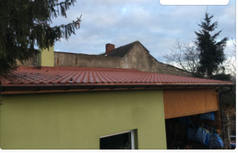
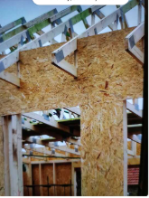
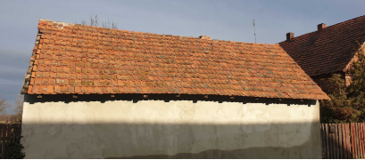
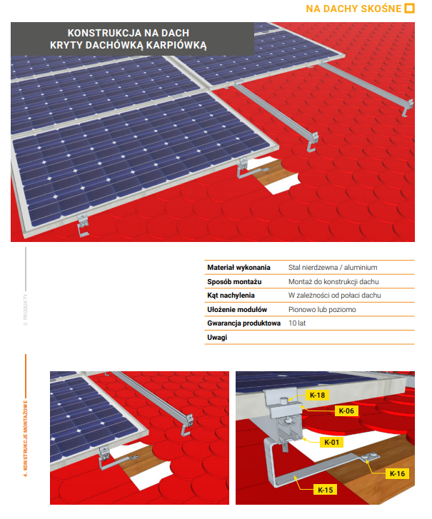
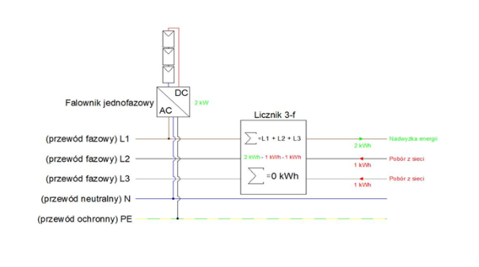



**Odnawialne źródła energii\
FOTOWOLTAIKA\
Q&A**

**INSTALACJA**

Inwerter

**Q**:** Przy jakim wzroście napięcia na sieci AC (OSD) wyłącza się falownik?

**A**: Inwertery pracują przy napięciu 230V z zakresem 10% czyli od 207-253V.

**--- ---**

Rozbudowa

**Q**: Klient ma instalację jednofazową i instalację od nas 3.375 kWp. Czy w przypadku posiadania instalacji trójfazowej można założyć drugą osobną instalację 3kWp? 

**A**: Tak, można

**--- ---**

**Q**: Klient ma naszą instalację o mocy 3,64kw na 280 VW. Czy jest możliwość jej rozbudowy? Jeśli tak, to czy panele mają mieć taką samą moc?

**A**: Przy takiej mocy posiada Klient/Klientka najprawdopodobniej inwerter jednofazowy, więc przy rozbudowie konieczna byłaby jego wymiana na większy. Panele muszą być takie same lub o podobnych parametrach, czyli np. możemy dołożyć tam 290 kWp, ale 345 kWp już nie.

\--- ---

**Q**: Klient ma instalację o mocy ponad 4 kW. Chcę zamontować kolejne 4 kW. Czy jest możliwość przełączania całości pod jeden inwerter czy będą potrzebne dwie oddzielne instalacje?

**A**: Jeśli oba falowniki będą trójfazowe, to nie ma problemu, aby klient zrobił drugą instalację.

\--- ---

**Q**: Klient posiada instalację o mocy: 3,46kWp i falownik Solis Mini 3000 - 4G. Czy warto rozbudować instalacje o dodatkowe trzy panele przy tym falowniku?

**A**: Niestety, nie ma możliwości rozbudowy instalacji przy tym falowniku.

**DACH**

Poszycie dachu

**Q**: Czy instalacja fotowoltaiczna może zostać zamontowana na takim dachu? Jeżeli tak to w jakiej formie? Na ekierkach czy inaczej?

**A**: Jeżeli mamy mniej niż 10 stopni nachylenia, to możemy zastosować ekierki na śrubach dwugwintowych wkręcanych w krokwie.

\--- ---

**Q**: A czy na takim dachu można zamontować panele? Na górze blacha.

**A**: Tak, możemy. Krokwie muszą mieć min. grubości 6 cm. 

\--- ---

**Q**: Klient ma płaski dach (papa, styropian i szlaka/żużel). Od konkurencyjnych firm otrzymał informację, iż nie gwarantują, że dach nie będzie przeciekać. Czy są jakieś przeciwwskazania do montowania instalacji na czymś takim?

**A**: Nie, nie ma przeciwskazań. Montowaliśmy już na takich dachach kilkukrotnie - używamy systemu balastowego, nieinwazyjnego, który sprawdza się w tego typu konstrukcjach.

\--- ---

**Q**: Czy można zamontować PV na takim dachu? Krokwie są dobre.

**A**: Nie, ponieważ dachówka klejona jest na zaprawę. Nie da się jej zdjąć, nie niszcząc całej połaci.

\--- ---

**Q**: Czy montujemy na pleksie?

**A**: Nie, nie montujemy.

\--- ---

**Q**: Czy montujemy na blachodachówkę pokrytą gontem bitumicznym?

**A**: Jeżeli pod gontem znajdują się krokwie, to jak najbardziej.

\--- ---

**Q**: Jak montujemy panele na karpiówce?

**A**: Po zdjęciu pojedynczej dachówki uchwyty są wkręcane bezpośrednio w krokwie lub chwytane do łaty wkrętami farmerskimi w zależności od rodzaju dachu. Następnie do uchwytów przykręcane są śrubami profile aluminiowe, do których montowane są uchwyty do paneli i następnie na nie kładzione są panele. Wizualizacja poniżej.

Potencjalne przeszkody

**Q**: Instalacja na dachu przy hali produkcyjnej - z komina wydobywają się opary kwasu siarkowego, czy mogą one naruszać nasze konstrukcje?

**A**: Nie, toksyczne opary nie naruszą konstrukcji fotowoltaicznej. 

**GRUNT**

**Q**: Czy w ogóle jest możliwość zrobienia na gruncie instalacji, gdzie występuje nachylenie ?

**A**: Jeżeli jest duże nachylenie to panele muszą być skierowane na południe. W przypadku, gdy nachylenie nie jest większe niż 15 stopni, to ułożenie paneli może być dowolne. Jednak wcześniej trzeba sprawdzić z czego jest zrobiona "skarpa", bo jeżeli jest to usypka z gruzu, odpadów, głazów to nie wbijemy konstrukcji.

**CZĘŚĆ ELEKTRYCZNA**

Instalacja istniejąca

**Q**: Klient ma licznik jednofazowy, od którego odchodzi kabel miedziowy do skrzynki, ale od skrzynki do słupa jest już aluminium. Czy w tym przypadku możemy założyć panele? Jakie mamy rozwiązania?

**A**: Jeśli połączenie miedzi z aluminium jest po stronie sieci to my z tym nic nie możemy zrobić. Jeśli u klienta jest kabel miedziowy to możemy podłączyć się w rozdzielni głównej. 

\--- ---

**Q**: Czy jednofazowy układ można połączyć z falownikiem Solar Edge (instalacja 3,45 kW)?

**A**: Tak, nie ma przeciwwskazań, żeby do instalacji 3,45 kW zastosować falownik Solar Edge. Byłby to model SE3000H.

\--- ---

**Q**: Jak sprawdzić czy napięcie w sieci nadaje się pod PV. Dotyczy miejsc o mniejszym zagęszczeniu, np. na odludziu.

**A**: Bez miernika nie jesteśmy w stanie sprawdzić napięcia u klienta.

Przyłącze

Przewody

**Q**: Kabel jest przeciągnięty do budynku gospodarczego, w którym nie ma puszki elektrycznej. Na tym właśnie budynku klient chciałby położyć PV. Co powinien zrobić? Czy wymagany jest przekop?

**A**: Ekipa zawsze może wykorzystać istniejący przewód, zrobić puszkę/rozdzielnię i podłączyć instalację fotowoltaiczną. Wszystko zależy od stanu i przekroju przewodu. Brakuje również informacji o mocy instalacji, którą mamy założyć.

\--- ---

**Q**: Klient ma jeden licznik w domu i pod ten licznik ma podłączone 3 rozdzielnie: jedną w domu i dwie osobne na garażach. W momencie, gdy klient chce założyć instalacje na garażu to możemy wpiąć się w tą rozdzielnię umieszczoną na garażu czy to musi być ta znajdująca się tuż przy liczniku?

**A**: To zależy od przewodów zasilających rozdzielnie – czy przewód zasilający te rozdzielnie jest umieszczony na jakimś zabezpieczeniu. Nie jest to niemożliwe, ale lepszym i bezpieczniejszym rozwiązaniem dla instalacji jest podłączenie jej w miejscu przechodzenia zasilania od licznika.

Moc instalacji (przyłączeniowa i umowna)

**Q**: Ile należy doliczyć kWp do rocznego zużycia energii w przypadku domowej ładowarki dla samochodu elektrycznego?

**A**: Pojemność baterii takiego samochodu wynosi ok. 40 kWh. Jeżeli klient korzysta z samochodu elektrycznego 5 dni w tygodniu, to można założyć, że wykorzystuje ok. 1000km w tydzień, zatem wyliczenia są następujące: 40kWh x 5dni x 54 tygodnie = 10 800 kWh, co równa się instalacji o mocy 11 kWp. Rocznie otrzymamy w ten sposób aż 54 tysięcy km rocznie. Jest to niemała liczba, zatem pozostaje zadać klientowi pytanie o pokonane kilometry. Przykładowo, jeżeli klient pokonuje rocznie ok. 18 tys. km, to należy podzielić tą wartość w następujący sposób: 10 800 / 3 =  3 600 kWh  = 3,6 kWp.

**USŁUGI DODATKOWE**

Przekop

**Q**: Czy jeżeli klient chce zamontować instalację na gruncie, ale główne bezpieczniki ma na strychu to czy pobieramy dodatkowe opłaty za przygotowanie terenu (nie licząc przekopu)?

**A**: Tak, trzeba doliczyć opłatę za przewód, który będzie przechodził po bryle budynku.

\--- ---

**DOTACJE I ULGI BIZNESOWE**

Pojawiają się pytania dotyczące bilansowania dla liczników jednofazowych w instalacji klienta, który ma w domu instalację trójfazową. Poniżej diagram, który powinien rozjaśnić wątpliwości.

Dodatkowe informacje: <https://www.gramwzielone.pl/energia-sloneczna/32839/bilansowanie-miedzyfazowe-u-prosumentow-jednak-mozna>

\--- ---

**Q**: Czy rolnik któremu robimy instalację na 23% VAT (taryfa C i NIP na fakturę) może po odliczeniu VAT skorzystać z ulgi inwestycyjnej 25% od ceny netto??

**A**: Jeżeli podatnik podatku rolnego:

\- nie jest podatnikiem podatku VAT i nie ma prawa do odzyskania podatku związanego z zakupem towarów poprzez odliczenie go od podatku należnego, w załączonym do wniosku o ulgę zestawieniu poniesionych wydatków inwestycyjnych uwzględnia wynikającą z rachunków (faktur) kwotę z podatkiem VAT (kwota brutto);

\- jest podatnikiem podatku VAT, a zatem ma prawo do odzyskania podatku związanego z zakupem towarów poprzez odliczenie go od podatku należnego, w załączonym do wniosku o ulgę zestawieniu poniesionych wydatków inwestycyjnych uwzględnia wynikającą z rachunków (faktur) kwotę bez podatku VAT (kwota netto).

Podstawa prawna: ustawa z dnia 15 listopada 1984 r. o podatku rolnym tj. z dnia 8 lipca 2019 r. (Dz. U. z 2019 r., poz. 1256)

Program „Czyste powietrze”

**Q**: Kiedy otrzymam wypłatę dotacji?

**A**: Dotację uzyskuje się po zakończeniu inwestycji oraz złożeniu i pozytywnym rozpatrzeniu wniosku o płatność.

\--- ---

**Q**: Czy budynek musi być oddany do użytku?

**A**: Tak, we wniosku poświadcza się, że budynek jest odebrany. Budynek, który nie ma zakończonych formalności związanych z oddaniem go do użytku, traktowany jest jako budynek w budowie i zgodnie z regulaminem nie może być brany pod uwagę w programie Czyste Powietrze.

\--- --- ---

**Q**: Czy wniosek mogę złożyć dopiero po zakończeniu inwestycji i zapłaceniu wszystkich faktur?

**A**: Do złożenia wniosku o dofinansowanie nie jest wymagane zakończenie inwestycji ani posiadanie faktur. Wniosek o dofinansowanie może być złożony zarówno przed rozpoczęciem inwestycji, w trakcie, jak i po jej zakończeniu. 

Zakończenie inwestycji oraz posiadanie opłaconych faktur jest wymagane dopiero przy składaniu wniosku o wypłatę dotacji.

\--- ---

**Q**: Czy mogę uzyskać podwyższony poziom dofinansowania?

**A**: O podwyższony poziom dofinansowania mogą się ubiegać osoby z dochodem poniżej 1400 zł netto na osobę w gospodarstwie wieloosobowym i poniżej 1960 zł netto w przypadku gospodarstwa jednoosobowego.  Podstawą do ubiegania się o wyższe dofinansowanie jest zaświadczenie z gminy wskazujące miesięczny dochód na osobę w gospodarstwie domowym wydawane przez gminę na wniosek Mieszkańca.

\--- ---

**Q**: Planuję założenie fotowoltaiki teraz natomiast wymianę pieca dopiero za pół roku, czy mogę wtedy złożyć wniosek na obie inwestycje?

**A**: Jeśli od pierwszej faktury za instalację fotowoltaiczną do momentu złożenia wniosku nie minie pół roku jest możliwość złożenia wniosku dopiero po montażu pompy. Natomiast w przypadku pewności co do przeprowadzenia obydwu przedsięwzięć lepszym rozwiązaniem może być złożenie wniosku o dofinansowanie teraz a rozliczenie dotacji po zakończeniu obydwu modernizacji.

\--- ---

**Q**: Czy mogę połączyć to dofinansowanie z innym programem jak „Mój Prąd” czy „Ulga termomodernizacyjna”?

**A**: Instalacja fotowoltaiczna zgłoszona do programu Mój Prąd musi być wyłączona z zakresu programu Czyste Powietrze. W przypadku ulgi termomodernizacyjnej, można z niej skorzystać, natomiast podstawą do obliczenia jej wysokości będzie kwota modernizacji pomniejszona o uzyskane dofinansowanie.

